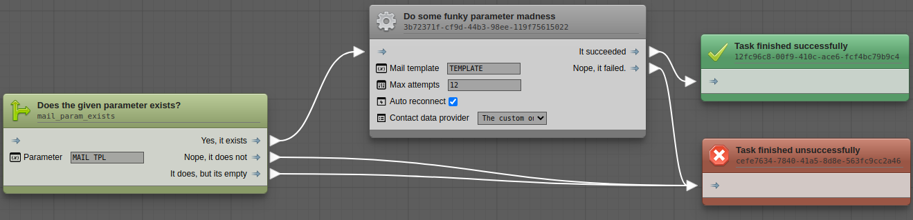
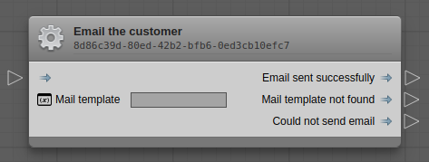

Flow-Graph
==========



Flow-graph is a **zero-dependency** graph visualizer and editor. It is designed
for building and maintaining business automation processes, but can be utilized
for other purposes as well.

## Installation

Using yarn
```
$ yarn add @haroldiedema/flow-graph
```

Or NPM
```
npm i -S @haroldiedema/flow-graph
```

## Getting started

In order to initialize flow-graph, we first need a point in our DOM to attach
to. This element will function as 'viewport' for our graph editor.

```html
<div id="fg"></div>
```
```typescript
import {FlowGraph} from '@haroldiedema/flow-graph';

const fg = new FlowGraph(document.getElementById('fg'));
```

You will now see an empty grid in which you can pan the camera around. You won't
be able to do anything else yet, because the template registry is currently
empty.

## Node templates

Before you can add nodes to the graph, flow-graph needs to know about what can
be added to it. You'll need to define _templates_ which consist of a unique
identifier that identifies the template, a display name, a description, input
and output sockets and so on.

A template can be defined like this:
```typescript

import {FlowGraph, NodeType} from '@haroldiedema/flow-graph';

const fg = new FlowGraph(document.getElementById('fg'));

fg.registerNodeTemplate({
    name: "Email the customer",
    type: "ACTION",
    systemName: "my.backend.logic.sendMailByTemplate",
    description: "Send an email to the customer by the given mail template.",
    inputs: [
        {
            name: "MAIL_TEMPLATE",
            type: "string",
            label: "Mail template"
        }
    ],
    outputs: [
        {
            name: "success",
            label: "Email sent successfully"
        }, {
            name: "tpl_not_found",
            label: "Mail template not found"
        }, {
            name: "failed",
            label: "Could not send email"
        }
    ]
});
```

When you right-click on the grid, the _fuzzy-finder_ will open and you'll see
that the node "Email the customer" is now available. Clicking it will insert the
node into the graph at the location of the cursor when you opened the 
fuzzy-finder.



### Template parameters

|name| type |description|
|---:|:----:|-----------|
|`name`|`string`|The display name of the node.|
|`type`|`NodeType`|Denotes the visual representation of a node. Can be one of the following: `ACTION`, `CONDITION`, `SUCCESS`, `FAILURE`.
|`systemName`|`string`|This name isn't used by flow-graph itself, but exported to the JSON object when the graph is exported. This name is used to identify the functionality of the node by your own software.|
|`description`|`string`|A longer description of the node. Visible when hovering over an option inside the fuzzy-finder.|
|`inputs`|`Input[]`|A list of inputs. See below.|
|`outputs`|`OutputSocket[]`|A list of output sockets. See below|

### Input parameters

|name| type |description|
|---:|:----:|-----------|
|`name`|`string`|The name of the socket. Used in the `parameters` object of the exported JSON.|
|`type`|`string`|The data type of the input. Can be one of `string`, `number`, `boolean` or `select`.|
|`label`|`string`|The label to display in the rendered node for this input.|
|`items`|`object`|A key/value object of items to show if `type` is set to `select`.|

### Output parameters
|name| type |description|
|---:|:----:|-----------|
|`name`|`string`|The name - or rather _identifier_ - of the output socket. This is a key in the `exitStates` object in the exported JSON that connects this node to another.|
|`label`|`string`|The label to show on the rendered node for this output socket.|

## Importing & Exporting graphs

```typescript
const data = fg.export();
```

The method `export` of `FlowGraph` will return a JSON object that represents the
current state of the graph. The `steps` object contains a list of placed nodes,
indexed by the ID of the node. Exit states of nodes reference the ID of the node
to determine where to go next in the process/flow.

```json
{
    "steps": {
        "step2": {
            "systemName": "my.backend.logic.sendMailByTemplate",
            "parameters": {
                "MAIL_TEMPLATE": ""
            },
            "exitStates": {},
            "position": {
                "x": 774,
                "y": 199
            }
        },
        "entry": {
            "systemName": "my.backend.logic.sendMailByTemplate",
            "parameters": {
                "MAIL_TEMPLATE": ""
            },
            "exitStates": {
                "success": "step2",
                "tpl_not_found": "step2",
                "failed": "step2"
            },
            "position": {
                "x": 193,
                "y": 207
            }
        }
    }
}
```

The same object can be imported using the `import` method on `FlowGraph`.

```typescript
fg.import(data);
```

Importing data will clear the existing graph before rendering the imported data.


## Events

The `FlowGraph` instance is an `EventEmitter` type. You can listen to these
events by using the `once`, `on` or `when` methods.

For example:
```typescript
fg.on('select', (node: Node) => {
    console.log(`${node.systemName} is selected!`);
});
```

The listen methods return an `EventSubscriber` object which can be used to
unsubscribe a listener like so:

```typescript
const subscriber = fg.on('select', (node: Node) => {
    // Do stuff.
});

// Unsubscribe.
subscriber.unsubscribe();

// Or...
fg.off(subscriber);
```

### `select`

> Callback signature: `(node: Node) => any`

Invokes the given callback function when a node is selected by the user.

### `deselect`

> Callback signature: `(node: Node) => any`

Invokes the given callback function when a node is deselected by the user.
